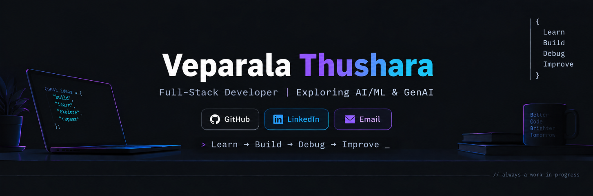

<div align="center">



</div>

---
<div align="center">


<br>

<a href="https://github.com/Thushara3005">

</a>
&nbsp;
<a href="https://www.linkedin.com/in/thushara-veparala">

</a>
&nbsp;
<a href="mailto:veparalathushara30@gmail.com">

</a>

<br><br>


</div>

---

---

## { WHO AM I }

I'm a B.Tech student and developer who enjoys turning ideas into working applications.

I started with web development and gradually became more interested in Python, data, machine learning, and generative AI.

Currently, I'm focused on strengthening my fundamentals, building useful things, and exploring where software engineering meets AI.

---

## { CURRENT STATE }

🎓 **B.Tech Student**  
🤖 **Exploring AI / ML / GenAI**  
🌐 **Building full-stack applications**  
🧠 **Strengthening DSA & problem solving**  
🚀 **Turning ideas into working products**

<br>

**CURRENTLY →**

`Python` → `NumPy` → `Pandas` → `Machine Learning` → `GenAI`

---

## { WHAT I'M FOCUSED ON }

| Area | Focus |
|------|-------|
| 🤖 **AI / ML** | Building strong foundations in machine learning |
| 🧠 **GenAI** | Exploring LLMs, RAG, and AI-powered applications |
| 🌐 **Full-Stack** | React, TypeScript, Node.js, and databases |
| 💻 **Problem Solving** | DSA, algorithms, and writing better solutions |

---

## { CURRENTLY LEARNING }

```text
Python
  ↓
NumPy + Pandas
  ↓
Data & Statistics
  ↓
Machine Learning
  ↓
Deep Learning
  ↓
GenAI / LLMs
```

I'm focusing on understanding the fundamentals first and gradually moving toward building practical AI-powered applications.

---

## { MY APPROACH }

> **Learn → Build → Debug → Improve**

I don't want to just learn how technology works — I want to understand why it works.

I learn by building, experimenting with ideas, solving problems, breaking things, and figuring out how to make them better.

---

## { BEYOND THE CODE }

```text
CURIOSITY
    ↓
EXPERIMENT
    ↓
CREATE
    ↓
LEARN
    ↓
REPEAT
```

I enjoy exploring new technologies, participating in hackathons, experimenting with ideas, and learning through hands-on experience.

For me, development isn't just about writing code — it's about continuously discovering what I can build next.

---

## { LET'S CONNECT }

I'm always open to connecting with developers, learning from others, and exploring interesting ideas.

<p align="center">
  <a href="https://github.com/Thushara3005">GitHub</a>
  &nbsp; • &nbsp;
  <a href="https://www.linkedin.com/in/thushara-veparala">LinkedIn</a>
  &nbsp; • &nbsp;
  <a href="mailto:veparalathushara30@gmail.com">Email</a>
</p>

<p align="center">
  <i>Keep learning. Keep building.</i>
</p>
